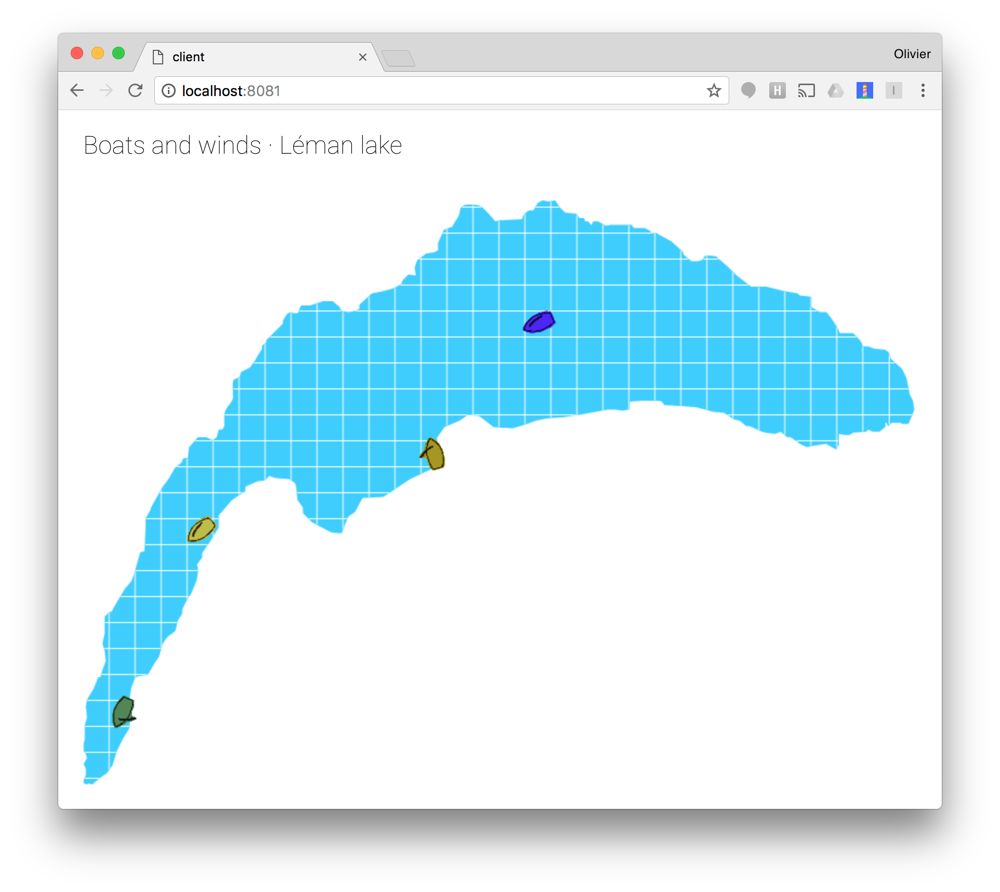

# PAWA

Web animation of boats riding the winds of lake Leman, using the [Phaser.io](https://phaser.io) library, [Polymer Elements](https://elements.polymer-project.org) and the [Neo4j graph database](https://neo4j.com).



## Setup

See the [contributing guide](docs/CONTRIBUTING.md) to setup your development environment. In a nutshell, here's how to download the sources and fetch the client app dependencies:

```bash
git clone git@github.com:olange/pawa.git
cd pawa/
npm install
```

## Run

The app requires two back-end services to run: the Neo4j graph database server, and the Polymer application server.

Open a first terminal window and start the Neo4j database server; you can then access the Neo4j console on [`http://localhost:7474/`](http://localhost:7474/), to explore the database contents:

```bash
npm run start-db
```

Then open a second terminal window and start the Polymer application server; you can then access the front-end app at [`http://localhost:8081`](http://localhost:8081):

```bash
npm run start-app
```